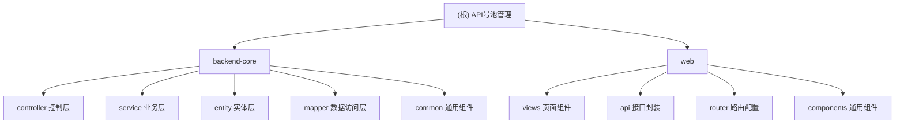

# API号池管理系统

## 变更记录 (Changelog)

### 2025-08-24 23:51:47
- 初始化AI上下文，完善项目架构文档
- 生成模块结构图和导航体系
- 建立基础的AI协作框架

## 项目愿景

API号池管理系统是一个用于管理和监控多个API服务池的全栈Web应用。系统通过集中化的管理界面，实现对API账户、代理服务器、服务池的统一管理，并提供实时监控、延迟测试、错误日志跟踪等功能。

## 架构总览

这是一个典型的前后端分离架构，采用Spring Boot + Vue.js技术栈：

- **后端**：基于Spring Boot 3.0.2的RESTful API服务，使用SQLite数据库存储
- **前端**：Vue.js 3 + Element Plus的单页面应用，提供直观的管理界面
- **数据持久化**：MyBatis ORM + SQLite数据库
- **认证授权**：sa-token轻量级认证框架
- **外部通信**：OkHttp客户端进行API池连接测试

## 模块结构图



## 模块索引

| 模块名称 | 路径 | 职责描述 | 主要技术 |
|---------|------|---------|---------|
| **backend-core** | `./` | Spring Boot后端核心，提供RESTful API服务 | Spring Boot, MyBatis, SQLite |
| **frontend-webapp** | `./web/` | Vue.js前端应用，提供管理界面 | Vue3, Element Plus, TypeScript |

## 运行与开发

### 环境要求
- Java 17+
- Node.js 16+
- Maven 3.6+

### 快速启动

**后端启动：**
```bash
# 编译打包
mvn clean package

# 启动应用
mvn spring-boot:run
# 或直接运行jar包
java -jar target/api-pool-0.0.1-SNAPSHOT.jar
```

**前端启动：**
```bash
cd web
npm install
npm run dev
```

访问地址：
- 前端：http://localhost:5173
- 后端API：http://localhost:8080/api

### 数据库初始化

系统使用SQLite数据库，数据文件位于：`./data/apipool.db`

首次运行时会自动创建数据库文件和必要的表结构。

## 测试策略

### 后端测试
- 单元测试：基于JUnit 5，测试覆盖服务层和工具类
- 集成测试：Spring Boot Test，测试完整的API调用链路

```bash
mvn test
```

### 前端测试
当前暂无前端测试套件，建议后续补充：
- 组件单元测试：基于Vue Test Utils + Jest
- E2E测试：基于Cypress或Playwright

## 编码规范

### 后端规范
- 遵循阿里巴巴Java开发手册
- 使用Lombok简化实体类代码
- 控制器层统一使用Result包装返回结果
- 服务层方法需要事务注解和异常处理

### 前端规范
- 遵循Vue.js官方风格指南
- 使用TypeScript增强类型安全
- 组件命名采用PascalCase
- API接口统一封装在api目录下

## AI使用指引

### 代码修改原则
1. **保持现有架构**：不轻易改变Spring Boot和Vue.js的基础架构
2. **渐进式改进**：优先修复bug和性能优化，而非大规模重构
3. **测试优先**：新增功能必须包含对应的测试用例

### 常见任务指引
- **新增API接口**：参考`PoolController`的实现方式
- **新增前端页面**：参考`views/pool/Index.vue`的结构
- **数据库操作**：使用MyBatis XML映射，参考`mapper/*.xml`文件
- **权限控制**：基于sa-token，参考`SaTokenConfig`配置

### 禁止操作
- 删除或移动现有的数据库文件
- 修改Maven或npm的核心依赖版本（除非明确需要升级）
- 更改项目的基础目录结构